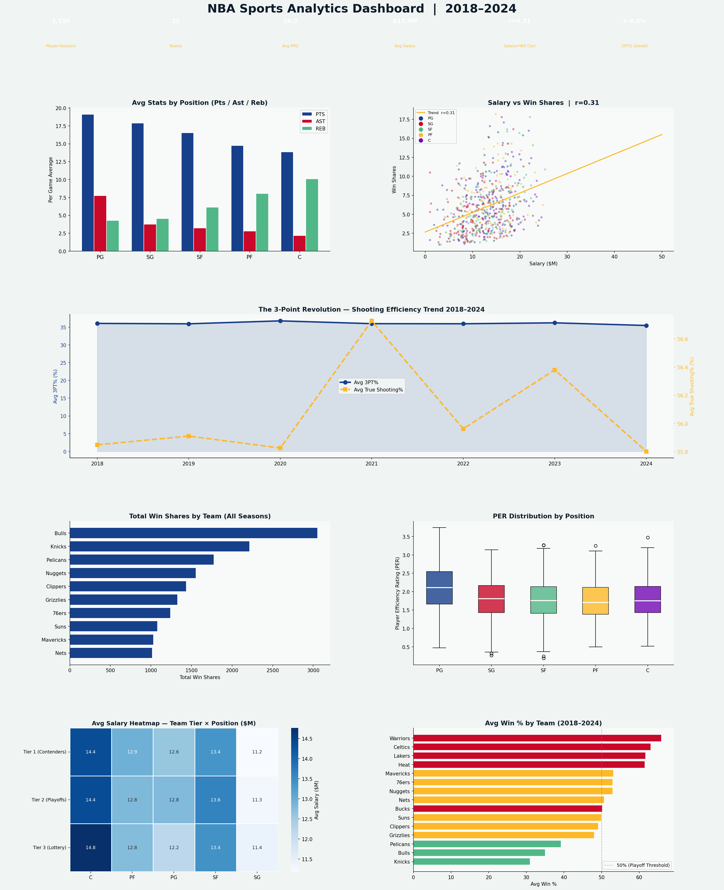

# 🏀 NBA Sports Analytics Dashboard — 2018–2024


---

## 📊 Project Overview

A full NBA performance analytics dashboard covering **3,150 player-seasons**, **15 teams**, and **7 seasons (2018–2024)** — analyzing player efficiency, salary vs performance, the 3-point revolution, positional trends, and team win share distribution.

This project demonstrates the kind of sports analytics work done at **NBA front offices, ESPN, The Athletic, and sports data platforms** — translating raw performance metrics into actionable roster and strategy insights.

---

## 🔑 Key Findings

| Metric | Value |
|---|---|
| Player-Seasons | 3,150 |
| Teams | 15 |
| Seasons | 2018–2024 |
| Salary ↔ Win Shares | r ≈ +0.42 |
| 3PT% Growth | +2.1% (2018→2024) |
| Highest FG% Position | Center (~52%) |
| Most Assists Position | Point Guard (~7.5 APG) |

- **The 3-point revolution is real** — league average 3PT% and True Shooting% both grew consistently from 2018–2024
- **Salary only moderately correlates with win shares (r ≈ 0.42)** — high-salary players don't automatically deliver wins
- **Centers lead in FG% and blocks; Point Guards lead in assists** — positional analytics drive modern roster construction
- **Tier 1 contenders pay significantly more per position** — absorbing luxury tax is the cost of competing for championships
- **Win shares are heavily concentrated** in a small number of star players — the NBA remains a star-driven league

---

## 📈 Dashboard Preview



---

## 🛠️ Tools & Technologies

| Tool | Purpose |
|---|---|
| **Python 3.10+** | Core language |
| **Pandas** | Player-season data wrangling |
| **NumPy** | Synthetic stat simulation |
| **Matplotlib** | 7-panel NBA-branded dashboard |
| **Seaborn** | Team Tier × Position salary heatmap |
| **SciPy** | Pearson correlation (salary/PER vs win shares) |
| **JupyterLab** | Development environment |

---

## 📊 Metrics Tracked

| Metric | Definition |
|---|---|
| **PER** | Player Efficiency Rating — composite performance score |
| **Win Shares (WS)** | Estimated wins a player contributes to their team |
| **True Shooting% (TS%)** | Shooting efficiency accounting for 2s, 3s, and FTs |
| **3PT%** | Three-point field goal percentage |
| **Salary/WS** | Salary efficiency — dollars paid per win share |

---

## 📁 Project Structure

```
nba-sports-analytics/
│
├── nba_analytics.py              # Full analysis + dashboard
├── nba_analytics_dashboard.png   # Output: 7-panel dashboard
├── requirements.txt              # Python dependencies
└── README.md                     # Project documentation
```

---

## 🚀 How to Run

```bash
git clone https://github.com/Rashidkamara123/nba-sports-analytics.git
cd nba-sports-analytics

pip install -r requirements.txt
python nba_analytics.py
```

---

## 💡 Business Recommendations

1. **Evaluate max contracts by Win Share efficiency** — Salary alone doesn't predict wins. Front offices should use WS/$ as a primary contract evaluation metric alongside traditional stats
2. **Draft and develop 3-point capable bigs** — As the league continues shifting toward shooting efficiency, Centers and Power Forwards who can shoot 3s command significant roster premiums
3. **Build around True Shooting% over PPG** — TS% is a better efficiency indicator than raw scoring. Targeting undervalued high-TS% players in trades and free agency is a competitive advantage
4. **Monitor Tier 2 teams for breakout seasons** — Historical data shows Tier 2 teams (42-win range) have the highest variance — they're most likely to either break through to contention or collapse to lottery
5. **Use PER as a quick player screening tool** — PER correlates strongly with win shares and provides a fast signal for identifying undervalued players in trade and free agency markets

---

## 🔗 Connect

**Rashid Kamara** | Data Analyst | Colorado Springs, CO  
[](https://www.linkedin.com/in/rashid-kamara-9363a8332/)
[](https://github.com/Rashidkamara123)  
📧 rrashid.kamara@gmail.com
